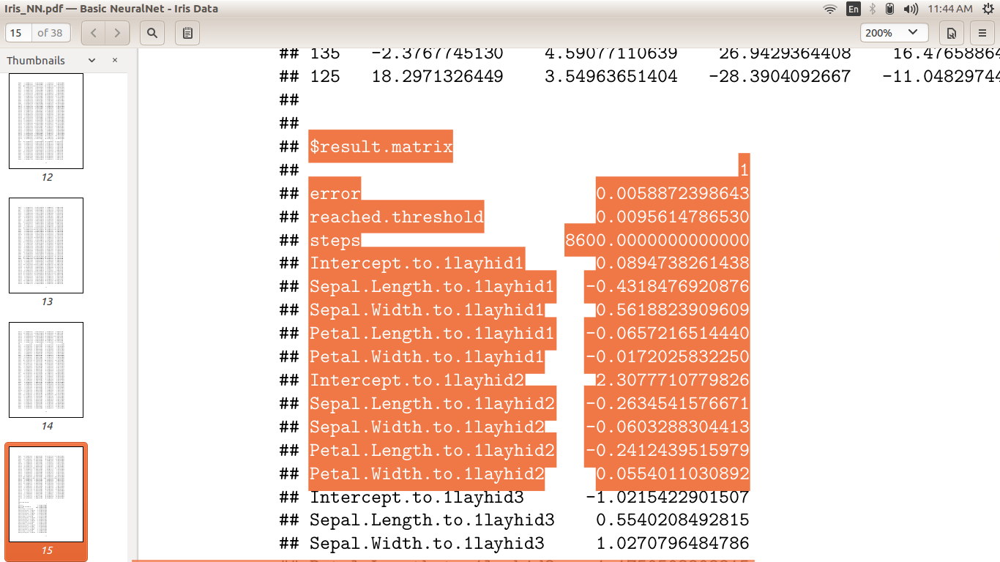
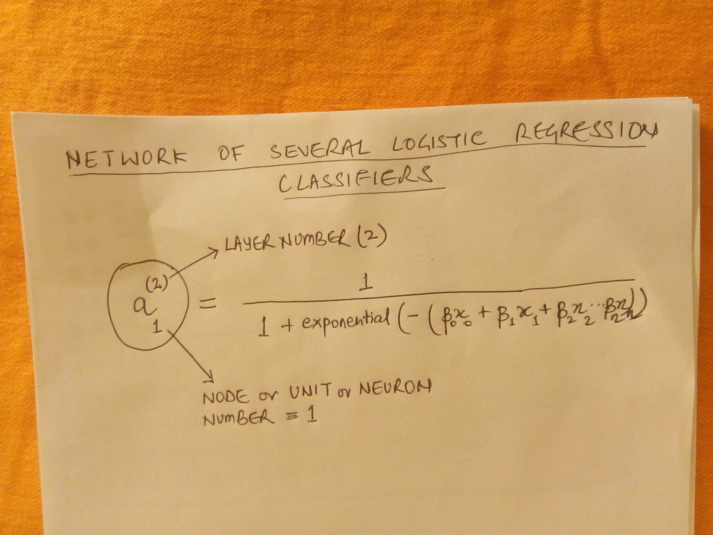
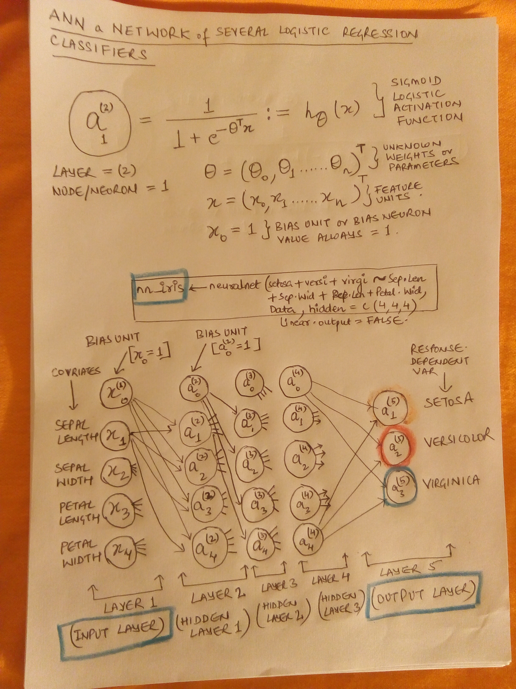
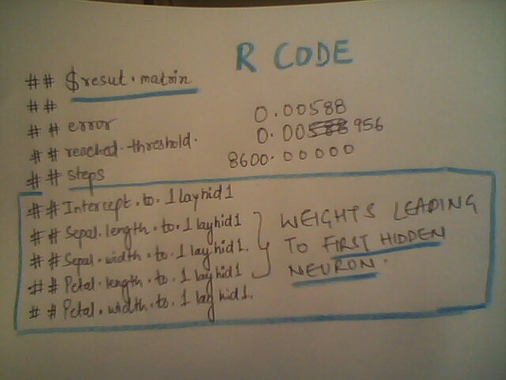
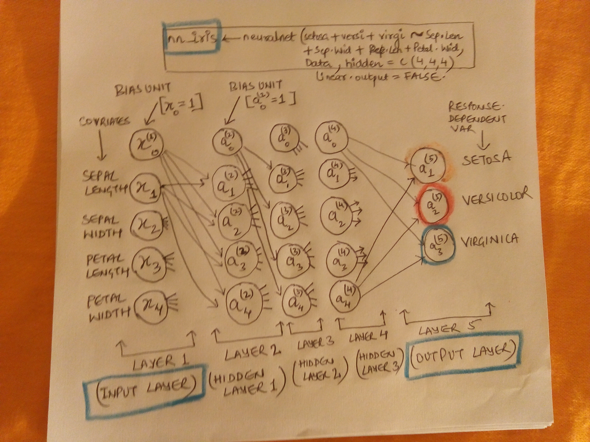
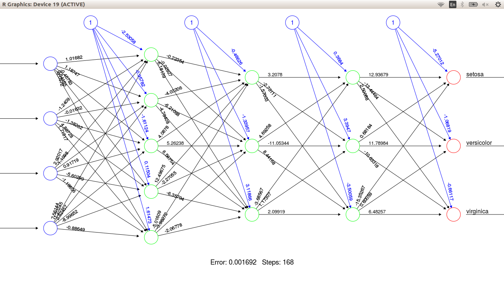
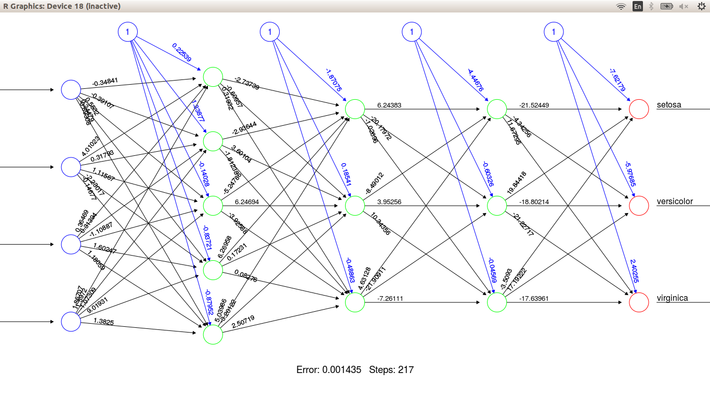

### Introductory Images of Neuralnets and RStudio Screencaptures :-  

#  

R_Image_1: 

#

R_Image_2: 

#  

R_Image_2_1: 

#  

R_Image_3: 

#  

R_Image_3_1: 

#  

R_Image_4: 

#  

R_Image_5: 

#  

R_Image_6: 

#  

